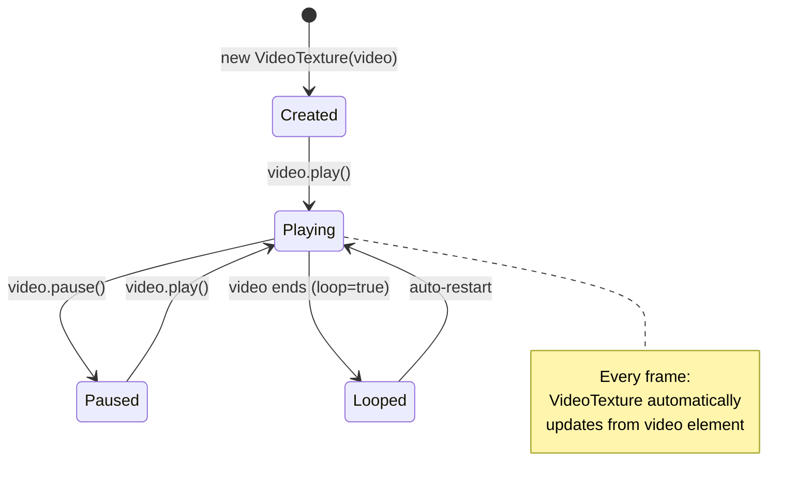

# Three.js Video Background

Three.jsのシーン内にMP4動画をテクスチャとして平面メッシュに貼り付け、モデルの背後に配置する手順。アニメーションとの同期再生やポーズ制御も含む。

## 前提条件

```json
{
  "dependencies": {
    "three": "^0.160.0"
  }
}
```

## アーキテクチャ

```
<video id="bg-video"> (非表示)
        ↓
THREE.VideoTexture
        ↓
THREE.PlaneGeometry + MeshBasicMaterial
        ↓
シーンに追加（モデルの背後に配置）
```

## 実装手順

### Step 1: HTML側に非表示video要素を配置

```html
<video id="bg-video" loop playsinline muted style="display:none;">
    <source src="Videos/<動画ファイル>.mp4" type="video/mp4">
</video>
```

**属性の意味:**
| 属性 | 目的 |
|---|---|
| `loop` | ループ再生 |
| `playsinline` | モバイルでインライン再生（フルスクリーン防止） |
| `muted` | ミュート（自動再生ポリシー対策） |
| `style="display:none"` | DOM上を非表示（Three.jsが描画するため） |

### Step 2: VideoTexture の作成と平面への適用

```javascript
let bgVideo, bgTexture, bgPlane;

function setupVideoBackground() {
    bgVideo = document.getElementById('bg-video');
    if (!bgVideo) return;

    // VideoTextureの作成
    bgTexture = new THREE.VideoTexture(bgVideo);
    bgTexture.colorSpace = THREE.SRGBColorSpace;  // 正しい色空間

    // 平面ジオメトリ（動画表示用）
    const geometry = new THREE.PlaneGeometry(80, 45);  // 16:9に近い比率
    const material = new THREE.MeshBasicMaterial({
        map: bgTexture,
        side: THREE.DoubleSide   // 裏面からも見える
    });
    bgPlane = new THREE.Mesh(geometry, material);

    // モデルの背後に配置
    bgPlane.position.set(0, 22.5, -45);
    scene.add(bgPlane);
}
```

### Step 3: 動画再生の開始（タイミング制御あり）

```javascript
async function startBackgroundVideo() {
    if (bgVideo) {
        try {
            await bgVideo.play();
        } catch (err) {
            console.warn('Video play failed (needs user interaction):', err);
        }
    }
}

// アニメーション開始からN秒遅延で再生開始する場合
setTimeout(() => startBackgroundVideo(), 1000);
```

### Step 4: 一時停止/再開の連動

```javascript
let isPaused = false;

window.addEventListener('keydown', (e) => {
    if (e.code === 'Space') {
        e.preventDefault();
        isPaused = !isPaused;

        if (bgVideo) {
            isPaused ? bgVideo.pause() : bgVideo.play();
        }
    }
});
```

## カスタマイズ

### サイズと位置の調整

| パラメータ | 効果 |
|---|---|
| `PlaneGeometry(width, height)` | 動画表示面の大きさ |
| `position.x` | 左右位置 |
| `position.y` | 上下位置（通常は`height/2`で床から配置） |
| `position.z` | 奥行き（負の値=モデルの背後） |

### 動画のアスペクト比を自動計算

```javascript
bgVideo.addEventListener('loadedmetadata', () => {
    const videoAspect = bgVideo.videoWidth / bgVideo.videoHeight;
    const desiredHeight = 45;
    const desiredWidth = desiredHeight * videoAspect;

    bgPlane.geometry.dispose();
    bgPlane.geometry = new THREE.PlaneGeometry(desiredWidth, desiredHeight);
});
```

### 音声を有効にする場合

```html
<!-- muted属性を除去 -->
<video id="bg-video" loop playsinline style="display:none;">
```

> [!WARNING]
> `muted` を除去すると、ブラウザの自動再生ポリシーにより `play()` が失敗する場合がある。ユーザー操作（クリック等）をトリガーにして `play()` を呼ぶこと。

### ボックスステージのバックスクリーンに適用する場合

`threejs-box-stage` スキルと組み合わせて、バックスクリーンに直接動画を貼る:

```javascript
// setupBoxStage() の後に:
const videoTexture = new THREE.VideoTexture(document.getElementById('bg-video'));
videoTexture.colorSpace = THREE.SRGBColorSpace;
boxStage.back.material.map = videoTexture;
boxStage.back.material.color.setHex(0xffffff);
boxStage.back.material.needsUpdate = true;
```

この場合、別途 `bgPlane` を追加する必要はない。

### 再生位置のリセット（モーション同期用）

```javascript
// アニメーション再生前にリセット
bgVideo.currentTime = 0;
clock = new THREE.Clock();  // 時計もリセット
animate();
setTimeout(() => startBackgroundVideo(), 1000);  // 遅延再生
```

## VideoTexture のライフサイクル



## 注意事項

- `VideoTexture` はフレームごとに自動更新するため、`animate()` ループで特別な更新処理は不要
- `MeshBasicMaterial` を使用するとライティングの影響を受けない（動画をそのまま表示）
- `MeshStandardMaterial` を使用するとライティングの影響を受ける（暗い場所で暗くなる）
- 動画ファイルはブラウザが対応するコーデックである必要がある（H.264推奨）
- `SRGBColorSpace` を設定しないと色がくすんで見える場合がある
- 複数の動画を同時に使用する場合、GPUメモリに注意
