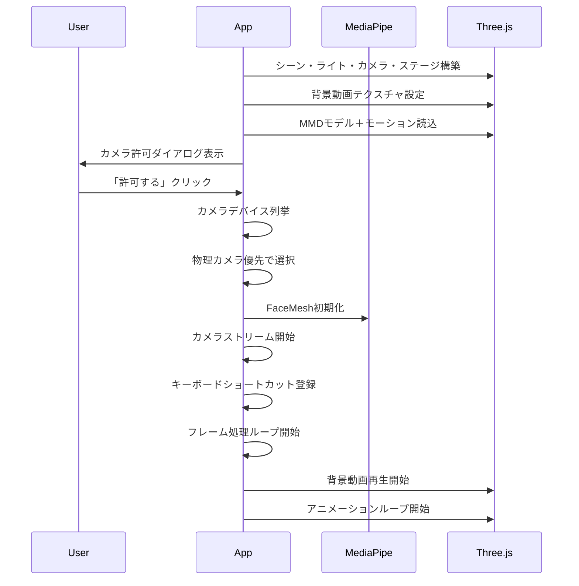

# 3D MMD Web Viewer — 仕様書

> **最終更新**: 2026-02-15  
> **リポジトリ**: [yugeyashiki/3DViewMMD](https://github.com/yugeyashiki/3DViewMMD) (Private)

---

## 1. アプリケーション概要

ブラウザ上でMMD（MikuMikuDance）モデルを3D表示し、Webカメラによる顔トラッキングでリアルタイムにカメラアングルを操作する、インタラクティブな3Dビューアーです。VTube Studioの仮想カメラにも対応し、アバターの動きをそのまま反映させることも可能です。

---

## 2. 技術スタック

| カテゴリ | 技術 | バージョン |
|---|---|---|
| 3Dレンダリング | Three.js | ^0.160.0 |
| MMDモデル読込 | MMDLoader / MMDAnimationHelper | Three.js addon |
| 顔トラッキング | MediaPipe Face Mesh | ^0.4.x |
| カメラユーティリティ | @mediapipe/camera_utils | ^0.3.x |
| ビルドツール | Vite | ^5.0.0 |
| 言語 | JavaScript (ES Modules) | - |

---

## 3. ディレクトリ構成

```
d:\AI3DViewMMD\
├── index.html          # メインHTML（UI、スタイル定義）
├── script.js           # アプリケーション全ロジック（593行）
├── package.json        # 依存関係定義
├── Models/
│   ├── model.pmx       # MMDモデルファイル
│   └── *.png           # テクスチャ画像群
├── Motions/
│   └── motion.vmd      # VMDモーションファイル
└── Videos/
    └── ワールドイズマイン.mp4  # 背景動画
```

---

## 4. 機能一覧

### 4.1 3Dモデル表示・モーション再生

| 項目 | 詳細 |
|---|---|
| モデル形式 | PMX（MikuMikuDance） |
| モーション形式 | VMD |
| 物理演算 | 無効（`USE_PHYSICS: false`） |
| アニメーション制御 | `MMDAnimationHelper`（sync: true, afterglow: 2.0） |

**設定パス:**
- モデル: `./Models/model.pmx`
- モーション: `./Motions/motion.vmd`

### 4.2 顔トラッキング（MediaPipe Face Mesh）

顔の動きをリアルタイムに解析し、カメラアングルに反映します。

| 項目 | 値 |
|---|---|
| 最大検出顔数 | 1 |
| ランドマーク精度 | refineLandmarks: true |
| 検出信頼度 | 0.5 |
| トラッキング信頼度 | 0.5 |
| 補間速度（LERP） | 0.25 |

**トラッキング対象:**
- **パララックス（視差効果）**: 鼻先（ランドマーク #1）の位置によるカメラの上下左右移動
- **ズーム（奥行き）**: 目の内隅間の距離（ランドマーク #133, #362）によるカメラの前後移動
- **まばたき検出**: 目の開閉量をモーフターゲット（`まばたき`, `Blink`等）に反映

### 4.3 カメラ操作

| 操作 | 効果 | 実装方式 |
|---|---|---|
| **顔の左右移動** | カメラが連動（視差効果） | 自動（MediaPipe） |
| **顔の前後移動** | ズーム（寄り引き） | 自動（MediaPipe） |
| **マウスホイール** | 手動ズーム | `wheel` イベント |
| **左クリック＋ドラッグ** | カメラアングル手動操作（排他方式） | `mousedown`/`mousemove`/`mouseup` |

**排他方式の仕様:**
- 左クリック中は顔トラッキングが一時停止し、マウスでカメラを自由に操作可能
- 左クリックを離すと顔トラッキングに自動復帰（オフセットはリセット）
- ドラッグ中もマウスホイール（ズーム）は有効
- カーソルが `grabbing` に変化（視覚的フィードバック）

### 4.4 動的カメラプロファイル（自動切替）

カメラデバイスに応じて、感度やズーム範囲を自動的に切り替えます。

| パラメータ | NORMAL（物理カメラ） | VTS（VTube Studio） |
|---|---|---|
| ズーム最小Z | 10 | 10 |
| ズーム最大Z | 150 | 300 |
| 奥行き係数 | 1,200 | 4,500 |
| 奥行きLERP | 0.1 | 0.08 |
| パララックス感度 | 7.5 | 18.0 |

**切替条件:** カメラのデバイス名に `vtubestudio` または `vtube studio` が含まれるかで自動判定。

### 4.5 カメラデバイス管理

| 機能 | 詳細 |
|---|---|
| デフォルト選択 | **物理カメラ優先**（仮想カメラを除外して検索） |
| 手動切替 | UIボタン「📷 ｶﾒﾗ切替」でローテーション |
| 除外キーワード | `vtubestudio`, `vtube studio`, `obs`, `unity`, `webcam 7`, `splitcam`, `manycam` |
| エラー時 | `NotReadableError`（デバイス占有）の場合、専用メッセージを表示。「閉じる」ボタンでリカバリ可能 |
| ストリーム解像度 | 1280×720（ideal指定） |

### 4.6 背景動画

| 項目 | 詳細 |
|---|---|
| ファイル | `Videos/ワールドイズマイン.mp4` |
| 表示方式 | `THREE.VideoTexture` を `PlaneGeometry`（80×45）に貼付 |
| 配置 | x:0, y:22.5, z:-45（モデルの背後） |
| ループ | 有効（`loop` 属性） |
| 音声 | ミュート（`muted` 属性） |

### 4.7 シーン構成

**ライティング（4灯構成）:**

| 種類 | 色 | 強度 | 位置 |
|---|---|---|---|
| HemisphereLight | 白/グレー | 1.0 | (0, 20, 0) |
| DirectionalLight | 白 | 1.5 | (5, 20, 10) |
| AmbientLight | 白 | 0.8 | - |
| PointLight | 白 | 1.0 | (0, 15, 5) |

**カメラ:**

| 項目 | 値 |
|---|---|
| タイプ | PerspectiveCamera |
| FOV | 20° |
| Near / Far | 0.1 / 1000 |
| 初期位置 | (0, 12, 75) |
| 注視点 | (0, 10, 0) |

**ステージ:**
- 床面: `PlaneGeometry`（200×200）、色: `#1a1a2e`、半透明
- グリッド: `GridHelper`（100×40分割）

---

## 5. キーボードショートカット

| キー | 機能 |
|---|---|
| **H** | カメラウィンドウの表示/非表示（トグル） |
| **Space** | MMDモーション＋背景動画の一時停止/再開（トグル） |

**一時停止中の挙動:**
- MMDモーション → 停止
- 背景動画 → 停止
- 顔トラッキング → **動作継続**
- 左クリックドラッグ → **操作可能**
- マウスホイール → **操作可能**

---

## 6. UI構成

### 6.1 カメラ許可ダイアログ
起動時にフルスクリーンのオーバーレイで表示。プライバシーポリシーを明示し、「許可する」「拒否する」ボタンで操作。

### 6.2 カメラプレビューウィンドウ
- **位置**: 左上（160×120px）
- **デフォルト**: 非表示
- **ボタン**: 「📷 ｶﾒﾗ切替」「✖ 消す」

### 6.3 エラーダイアログ
- **デザイン**: ダークモード、赤枠
- **ボタン**: 「閉じる」（ダイアログを閉じて操作継続）、「再読み込み」（ページリロード）

---

## 7. デバッグモード

URLパラメータ `?debug` を付与すると有効化されます。

```
http://localhost:5173/?debug
```

**追加されるログ:**
- FaceMeshの検出状態（2秒間隔）
- 奥行き計算の数値（ランダムサンプリング）
- カメラプロファイルの切替
- 一時停止/再開の状態変化

---

## 8. 初期化フロー



---

## 9. 設定パラメータ一覧（CONFIG）

| カテゴリ | キー | 値 | 説明 |
|---|---|---|---|
| 表示 | `MONITOR_WIDTH` | 0.5 | 仮想モニタ幅 |
| 表示 | `ASPECT_RATIO` | (動的) | ウィンドウのアスペクト比 |
| カメラ | `CAMERA_FOV` | 20 | 視野角（度） |
| カメラ | `CAMERA_POSITION` | (0, 12, 75) | 初期カメラ位置 |
| カメラ | `CAMERA_LOOKAT` | (0, 10, 0) | カメラ注視点 |
| トラッキング | `EYE_SCALE_X` | 20.0 | X軸の移動感度 |
| トラッキング | `EYE_SCALE_Y` | 18.0 | Y軸の移動感度 |
| トラッキング | `EYE_OFFSET_Y` | 14.0 | Y軸オフセット |
| トラッキング | `LERP_SPEED` | 0.25 | 補間速度 |
| トラッキング | `BLINK_THRESHOLD` | 0.08 | まばたき検出閾値 |
| シーン | `BACKGROUND_COLOR` | 0x333333 | 背景色 |
| シーン | `LIGHT_INTENSITY` | 1.5 | メインライト強度 |
| シーン | `AMBIENT_INTENSITY` | 0.8 | 環境光強度 |
| ズーム | `WHEEL_SENSITIVITY` | 0.15 | マウスホイール感度 |
| ドラッグ | `DRAG_SENSITIVITY` | 0.3 | マウスドラッグ感度 |

---

## 10. 起動方法

```bash
# 依存関係のインストール
npm install

# 開発サーバーの起動
npm run dev
```

ブラウザで `http://localhost:5173` にアクセスします。

---

## 11. 既知の制約事項

1. **カメラの排他使用**: VTube Studioが物理カメラを占有している場合、同じカメラをブラウザから使用できません。この場合はVTSの仮想カメラ（VTubeStudioCam）を使用してください。
2. **物理演算**: パフォーマンスの都合上、現在は無効化されています。
3. **音声出力**: 背景動画はミュート状態で再生されます。
4. **ブラウザ互換性**: Chrome/Edge推奨。MediaPipe Face MeshはWebAssemblyを使用するため、対応ブラウザが必要です。
