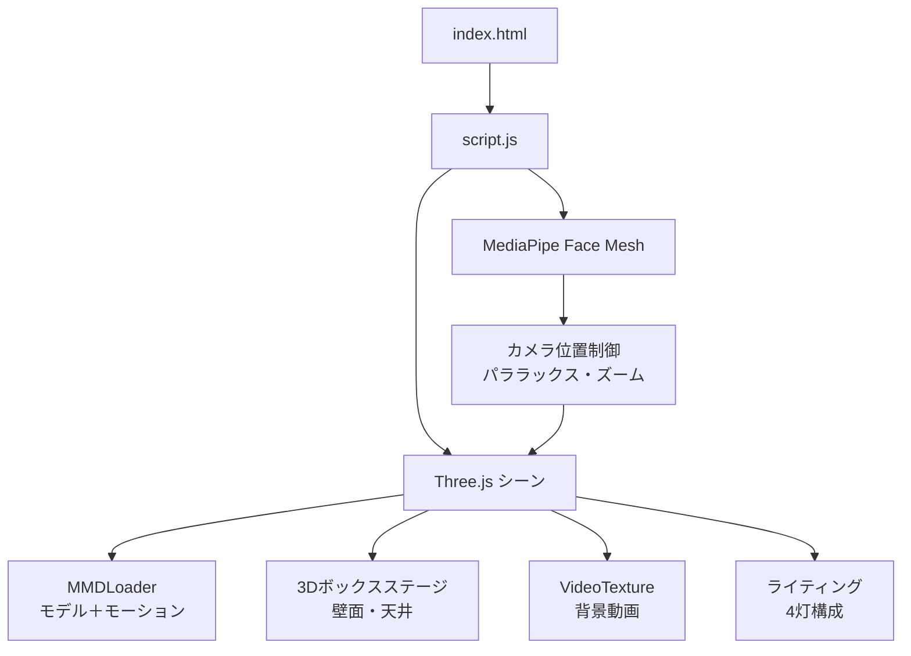
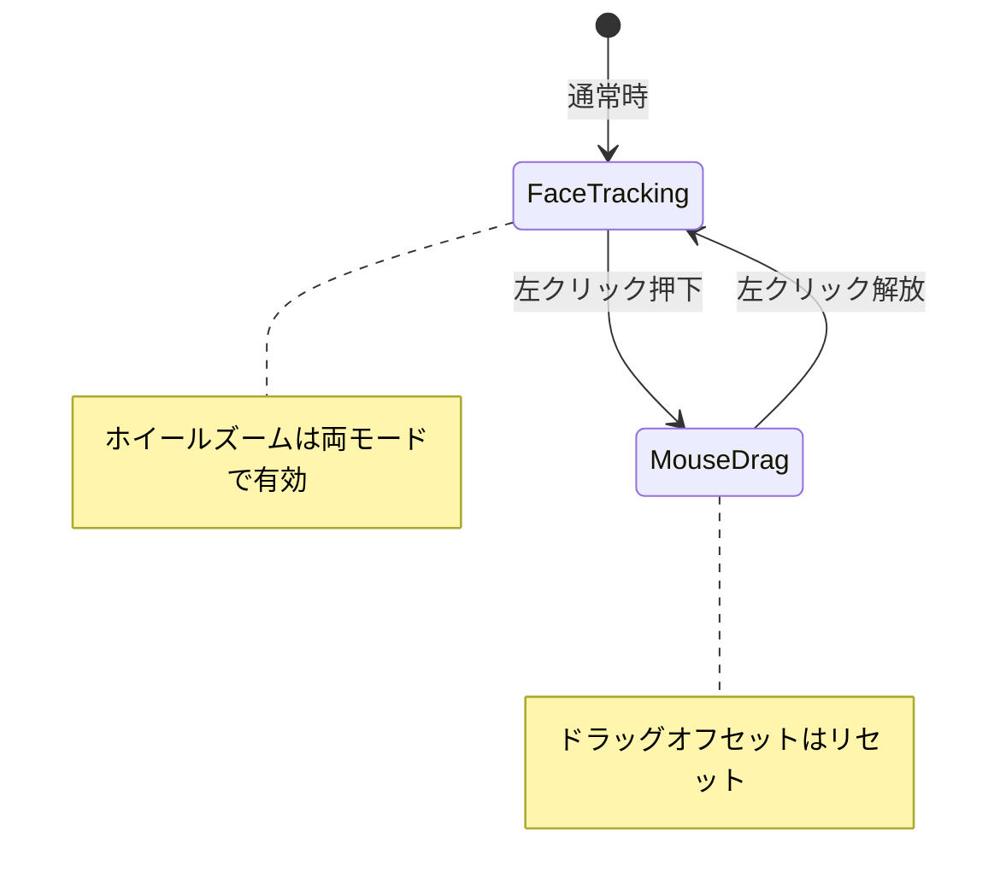
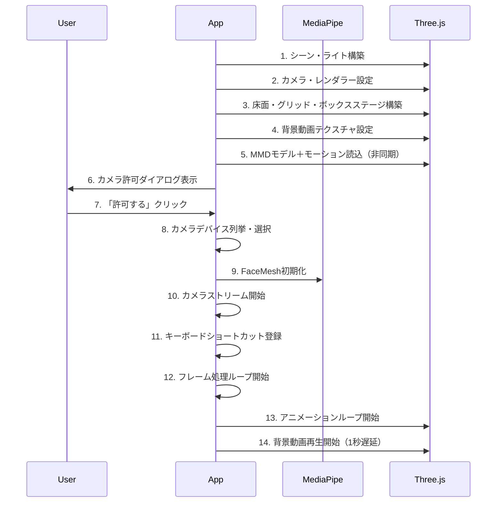
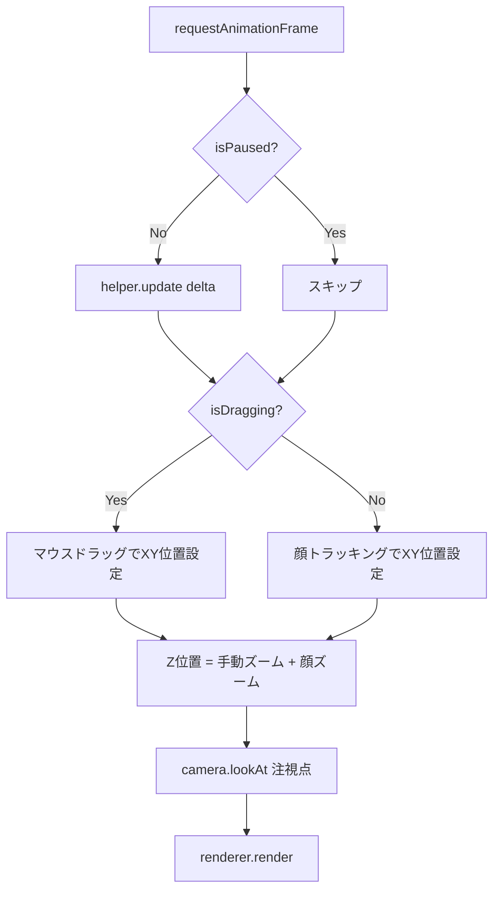

# 3D MMD Web Viewer — 汎用仕様書

> **最終更新**: 2026-02-21  
> **バージョン**: 1.0  
> **対象者**: 開発者（作成者以外含む）

---

## 1. アプリケーション概要

ブラウザ上でMMD（MikuMikuDance）モデルを3D表示し、Webカメラによる顔トラッキングでリアルタイムにカメラアングルを操作するインタラクティブ3Dビューアー。

### 主な特徴
- **PMXモデル＋VMDモーション再生**: MMD標準フォーマットをブラウザ上で直接再生
- **顔トラッキング連動カメラ**: ユーザーの頭の動きで自然な視差（パララックス）効果を実現
- **3Dボックスステージ**: 箱型の仮想空間で立体的な没入感を演出
- **背景動画**: モデルの背後にMP4動画を配置可能
- **VTube Studio連携**: 仮想カメラ入力に自動対応（感度プロファイル切替）

---

## 2. 技術スタック

| カテゴリ | 技術 | 用途 |
|---|---|---|
| **3Dレンダリング** | Three.js (^0.160.0) | シーン構築、レンダリング、カメラ制御 |
| **MMDモデル読込** | Three.js MMDLoader / MMDAnimationHelper | PMXモデル＋VMDモーション読込・再生 |
| **顔トラッキング** | MediaPipe Face Mesh (^0.4.x) | 顔ランドマーク検出 |
| **カメラユーティリティ** | @mediapipe/camera_utils (^0.3.x) | Webカメラストリーム管理 |
| **ビルドツール** | Vite (^5.0.0) | 開発サーバー・バンドル |
| **言語** | JavaScript (ES Modules) | アプリケーションロジック |

### 追加の依存関係（package.json）
- `@pixiv/three-vrm` (^3.0.0) — VRMモデルサポート（将来的な拡張用）
- `mmd-parser` (^1.0.4) — MMDファイルパース

---

## 3. ディレクトリ構成

```
ProjectRoot/
├── index.html          # メインHTML（UI・スタイル定義）
├── script.js           # アプリケーション全ロジック（単一ファイル構成）
├── package.json        # 依存関係定義
├── Models/
│   ├── *.pmx           # MMDモデルファイル（PMX形式）
│   └── *.png           # テクスチャ画像群
├── Motions/
│   └── *.vmd           # VMDモーションファイル（複数指定可能）
└── Videos/
    └── *.mp4           # 背景動画ファイル
```

> [!NOTE]
> 3Dモデル（PMX）、モーション（VMD）、動画（MP4）はそれぞれ所定のディレクトリに配置し、`CONFIG`オブジェクト内のパスを変更することで差替え可能。

---

## 4. アーキテクチャ

### 4.1 全体構成



### 4.2 ファイル構成

現在は**単一ファイル構成**（`script.js`に全機能を集約）。

| ファイル | 役割 | 行数 |
|---|---|---|
| `index.html` | HTML構造、CSS、UIコンポーネント | ~167行 |
| `script.js` | 全ロジック（初期化、3D、トラッキング、入力） | ~705行 |

### 4.3 主要関数一覧

| 関数名 | 責務 |
|---|---|
| `init()` | アプリケーション全体の初期化（非同期） |
| `setupThreeJS()` | カメラ・レンダラー・入力イベントの設定 |
| `setupRoom()` | 床面・グリッド・ボックスステージの構築 |
| `setupBoxStage()` | 3Dボックス（背面壁・側壁・天井）の計算と生成 |
| `updateBoxStageSize()` | ウィンドウリサイズ時のボックス再計算 |
| `setupVideoBackground()` | 背景動画テクスチャの初期化 |
| `startBackgroundVideo()` | 背景動画の再生開始 |
| `loadMMDAsync()` | MMDモデル＋モーションの非同期読込 |
| `requestCameraPermission()` | カメラアクセスの同意UI管理 |
| `setupFaceMesh()` | MediaPipe初期化、カメラ選択、ショートカット登録 |
| `startCamera()` | カメラストリーム開始＋プロファイル自動切替 |
| `onFaceResults()` | 顔検出結果のディスパッチ |
| `updateTracking()` | トラッキング値の計算（パララックス・ズーム・まばたき） |
| `animate()` | メインレンダリングループ |

---

## 5. 機能仕様

### 5.1 3Dモデル表示・モーション再生

| 項目 | 仕様 |
|---|---|
| モデル形式 | PMX（MikuMikuDance） |
| モーション形式 | VMD（複数ファイル同時指定対応） |
| 物理演算 | 設定で有効/無効切替（デフォルト: 無効） |
| アニメーション制御 | `MMDAnimationHelper`（同期モード、afterglow: 2.0） |
| テクスチャ欠落対策 | テクスチャ未読込時にグレー色にフォールバック |
| セルフグロー | 全マテリアルに`emissiveIntensity: 0.2`を付与 |

**設定箇所（CONFIG.MMD）:**
```javascript
MMD: {
    MODEL_PATH: './Models/<モデルファイル>.pmx',
    MOTION_PATHS: [
        './Motions/<モーションファイル1>.vmd',
        './Motions/<モーションファイル2>.vmd'  // 複数指定可能
    ],
    USE_PHYSICS: false
}
```

### 5.2 顔トラッキング（Face Tracking）

MediaPipe Face Meshで顔ランドマークを検出し、3つの要素をリアルタイムに制御する。

#### トラッキング対象

| 機能 | ランドマーク | 処理 |
|---|---|---|
| **パララックス（視差）** | #1（鼻先） | 顔の左右・上下移動 → カメラXY位置に変換 |
| **ズーム（奥行き）** | #133, #362（目の内隅） | 目の間隔 → カメラZ位置に変換 |
| **まばたき** | #159, #145, #33, #133 | 目の開閉量 → MMDモーフターゲットに反映 |

#### トラッキングパラメータ

| パラメータ | 値 | 説明 |
|---|---|---|
| `EYE_SCALE_X` | 20.0 | X軸方向の移動感度 |
| `EYE_SCALE_Y` | 18.0 | Y軸方向の移動感度 |
| `EYE_OFFSET_Y` | 14.0 | Y軸のベースオフセット |
| `LERP_SPEED` | 0.25 | 位置の線形補間速度（0-1、高いほど即応） |
| `BLINK_THRESHOLD` | 0.08 | まばたき判定の閾値 |

#### まばたきモーフターゲット名
以下の名前をMMDモデルから自動検索する:
- `まばたき`, `Blink`, `まばたき左`, `まばたき右`

#### ズーム計算アルゴリズム
```
baseFaceDistance = 初回検出時の目の内隅間距離（キャリブレーション）
depthChange = (currentDist - baseFaceDistance) × FACE_DEPTH_FACTOR
faceDepthOffset = LERP(faceDepthOffset, -depthChange, FACE_DEPTH_LERP)
```
顔がカメラに近づく → `currentDist`増大 → カメラがモデルに接近（ズームイン）

### 5.3 カメラ操作

3つの入力ソースが協調してカメラを制御する。

| 入力ソース | 制御対象 | 条件 |
|---|---|---|
| **顔トラッキング** | カメラXY位置 + Z（ズーム） | ドラッグ中は一時停止 |
| **マウスドラッグ（左クリック）** | カメラXY位置 | 顔トラッキングと排他 |
| **マウスホイール** | カメラZ（手動ズーム） | 常時有効 |

#### 排他方式（Exclusive Mode）


- **ドラッグ中**: 顔トラッキング一時停止、マウス移動でカメラ操作
- **ドラッグ解放**: 即時復帰（オフセットリセット）
- **カーソル変化**: `default` ↔ `grabbing`（視覚的フィードバック）
- **ドラッグ感度**: `DRAG_SENSITIVITY = 0.3`

### 5.4 動的カメラプロファイル

カメラデバイスに応じて感度パラメータを自動切替する。

| パラメータ | NORMAL（物理カメラ） | VTS（仮想カメラ） |
|---|---|---|
| `ZOOM_MIN_Z` | 10 | 10 |
| `ZOOM_MAX_Z` | 150 | 300 |
| `FACE_DEPTH_FACTOR` | 1,200 | 4,500 |
| `FACE_DEPTH_LERP` | 0.1 | 0.08 |
| `PARALLAX_SENSITIVITY` | 7.5 | 18.0 |

**切替ロジック:**
- デバイス名に以下のキーワードが含まれる場合 → VTSプロファイル適用
  - `vtubestudio`, `vtube studio`, `nizima`, `3tene`, `virtual camera`
- それ以外 → NORMALプロファイル適用

### 5.5 カメラデバイス管理

| 機能 | 仕様 |
|---|---|
| デフォルト選択 | 物理カメラ優先（仮想カメラを除外して検索） |
| フォールバック | 物理カメラなし → VTube Studio/nizima仮想カメラ → 最初のデバイス |
| 手動切替 | UIボタンでデバイスをローテーション |
| ストリーム解像度 | 1280×720（ideal指定） |
| エラーハンドリング | `NotReadableError`（占有エラー）に専用メッセージ |

**仮想カメラ除外キーワード:**
`vtubestudio`, `vtube studio`, `obs`, `unity`, `webcam 7`, `splitcam`, `manycam`

### 5.6 背景動画

| 項目 | 仕様 |
|---|---|
| 表示方式 | `THREE.VideoTexture` を `PlaneGeometry`（80×45）に貼付 |
| 配置 | `(x:0, y:22.5, z:-45)` — モデルの背後 |
| ループ | 有効 |
| 音声 | ミュート |
| 色空間 | `SRGBColorSpace` |
| 開始タイミング | アニメーションループ開始から1秒遅延で再生開始 |

**HTML側の設定:**
```html
<video id="bg-video" loop playsinline muted style="display:none;">
    <source src="Videos/<動画ファイル>.mp4" type="video/mp4">
</video>
```

### 5.7 3Dボックスステージ（壁面・天井）

ブラウザ画面を「3Dの箱の中」に見せるための仮想空間構造。

#### 構成要素

| 要素 | 配置 | 向き |
|---|---|---|
| **バックスクリーン（背面壁）** | カメラ正面奥（Z軸マイナス方向） | カメラに正対 |
| **左壁** | バックスクリーン左端 | Y軸 +90° |
| **右壁** | バックスクリーン右端 | Y軸 -90° |
| **天井** | バックスクリーン上端 | X軸 +90° |
| **床面** | Y = -0.1 | X軸 -90° |
| **グリッド** | 床面上 | 100分割、40サブ分割 |

#### バックスクリーンのサイズ計算
正面から見たときにビューポート全体を覆う寸法:
```
D (距離) = カメラZ位置 - バックスクリーンZ位置
height   = 2 × D × tan(FOV / 2)
width    = height × アスペクト比
```

#### マテリアル設定

| プロパティ | 値 |
|---|---|
| タイプ | `MeshStandardMaterial` |
| 描画面 | `DoubleSide` |
| roughness | 0.8 |
| metalness | 0.1 |
| 透過 | 有効（opacity: 0.95） |

#### パララックス効果との連携
- カメラが左右に動く → 側面壁が見え隠れ → 立体感
- カメラが上下に動く → 天井・床が見え隠れ
- ズームイン/アウト → バックスクリーンとの距離感変化
- **リサイズ対応**: ウィンドウリサイズ時にボックスの全ジオメトリを再計算

#### 設定パラメータ（CONFIG.BOX_STAGE）

| キー | 値 | 説明 |
|---|---|---|
| `BACK_Z` | -50 | バックスクリーンのZ位置 |
| `WALL_COLOR` | 0x1a1a2e | 壁面の色 |
| `WALL_OPACITY` | 0.95 | 壁面の透明度 |
| `DEPTH` | 50 | 箱の奥行き |

---

## 6. シーン構成

### 6.1 ライティング（4灯構成）

| # | 種類 | 色 | 強度 | 位置 | 役割 |
|---|---|---|---|---|---|
| 1 | `HemisphereLight` | 白/グレー | 1.0 | (0, 20, 0) | 天空・地面からの環境光 |
| 2 | `DirectionalLight` | 白 | 1.5 | (5, 20, 10) | メインライト（影あり） |
| 3 | `AmbientLight` | 白 | 0.8 | — | 全体のフィル光 |
| 4 | `PointLight` | 白 | 1.0 | (0, 15, 5) | モデル付近の補助光 |

### 6.2 カメラ

| 項目 | 値 |
|---|---|
| タイプ | `PerspectiveCamera` |
| FOV | 20° |
| Near / Far | 0.1 / 1000 |
| 初期位置 | (0, 12, 75) |
| 注視点 | (0, 10, 0) |

### 6.3 レンダラー

| 項目 | 設定 |
|---|---|
| タイプ | `WebGLRenderer` |
| アンチエイリアス | 有効 |
| ピクセル比 | `window.devicePixelRatio` |
| シャドウマップ | 有効 |
| 色空間 | `SRGBColorSpace` |

---

## 7. ユーザーインターフェース

### 7.1 カメラ許可ダイアログ
- **タイミング**: アプリ起動時にフルスクリーンオーバーレイで表示
- **ボタン**: 「許可する」（緑）/ 「拒否する」（赤）
- **プライバシー表示**: 映像データはデバイス内のみで処理される旨を明示

### 7.2 カメラプレビューウィンドウ
- **位置**: 左上（240×180px）
- **デフォルト**: 非表示（Hキーでトグル）
- **ミラー表示**: `scaleX(-1)`
- **ボタン**: 「📷 ｶﾒﾗ切替」「✖ 消す」

### 7.3 エラーダイアログ
- **デザイン**: ダークモード、赤枠、中央配置
- **ボタン**: 「閉じる」（操作継続）/ 「再読み込み」（ページリロード）

---

## 8. キーボードショートカット

| キー | 機能 |
|---|---|
| **H** | カメラプレビューウィンドウの表示/非表示トグル |
| **Space** | MMDモーション＋背景動画の一時停止/再開トグル |

### 一時停止中の挙動

| 要素 | 状態 |
|---|---|
| MMDモーション | ⏸ 停止 |
| 背景動画 | ⏸ 停止 |
| 顔トラッキング | ▶ 動作継続 |
| マウスドラッグ | ▶ 操作可能 |
| マウスホイール | ▶ 操作可能 |

---

## 9. 初期化フロー



---

## 10. メインループ（animate）

毎フレーム以下の処理を実行:



---

## 11. CONFIG 設定パラメータ一覧

### 表示・カメラ

| キー | デフォルト値 | 説明 |
|---|---|---|
| `MONITOR_WIDTH` | 0.5 | 仮想モニタ幅（トラッキング計算用） |
| `ASPECT_RATIO` | (動的) | ウィンドウのアスペクト比 |
| `CAMERA_FOV` | 20 | 視野角（度） |
| `CAMERA_NEAR` | 0.1 | ニアクリップ距離 |
| `CAMERA_FAR` | 1000 | ファークリップ距離 |
| `CAMERA_POSITION` | {x:0, y:12, z:75} | 初期カメラ位置 |
| `CAMERA_LOOKAT` | {x:0, y:10, z:0} | カメラ注視点 |

### 顔トラッキング

| キー | デフォルト値 | 説明 |
|---|---|---|
| `EYE_SCALE_X` | 20.0 | X軸移動感度 |
| `EYE_SCALE_Y` | 18.0 | Y軸移動感度 |
| `EYE_OFFSET_Y` | 14.0 | Y軸ベースオフセット |
| `EYE_POS_Z` | 30.0 | 初期Z位置 |
| `LERP_SPEED` | 0.25 | 補間速度 |
| `BLINK_THRESHOLD` | 0.08 | まばたき検出閾値 |

### シーン

| キー | デフォルト値 | 説明 |
|---|---|---|
| `BACKGROUND_COLOR` | 0x333333 | シーン背景色 |
| `LIGHT_INTENSITY` | 1.5 | メインDirectionalLight強度 |
| `AMBIENT_INTENSITY` | 0.8 | AmbientLight強度 |

### ボックスステージ

| キー | デフォルト値 | 説明 |
|---|---|---|
| `BOX_STAGE.BACK_Z` | -50 | バックスクリーンZ位置 |
| `BOX_STAGE.WALL_COLOR` | 0x1a1a2e | 壁面色 |
| `BOX_STAGE.WALL_OPACITY` | 0.95 | 壁面透明度 |
| `BOX_STAGE.DEPTH` | 50 | 箱の奥行き |

### 入力感度

| キー | デフォルト値 | 説明 |
|---|---|---|
| `WHEEL_SENSITIVITY` | 0.15 | マウスホイール感度 |
| `DRAG_SENSITIVITY` | 0.3 | マウスドラッグ感度 |

---

## 12. デバッグモード

URLパラメータ `?debug` を付与すると有効化。

```
http://localhost:5173/?debug
```

### 出力されるログ
| ログ内容 | 頻度 |
|---|---|
| FaceMesh検出状態 | 2秒間隔 |
| 奥行き（Depth）計算値 | ランダムサンプリング（1%） |
| カメラプロファイル切替 | 切替時 |
| 一時停止/再開の状態変化 | 操作時 |
| ボックスステージ寸法 | 生成時・リサイズ時 |

---

## 13. カスタマイズガイド

### モデル・モーション・動画の差替え

1. **モデル変更**: `Models/` にPMXファイルとテクスチャを配置し、`CONFIG.MMD.MODEL_PATH` を更新
2. **モーション変更**: `Motions/` にVMDファイルを配置し、`CONFIG.MMD.MOTION_PATHS` 配列を更新
3. **背景動画変更**: `Videos/` にMP4を配置し、`index.html` の `<source>` タグの `src` を更新

### カメラプロファイルの追加
`CONFIG.PROFILES` に新しいプロファイルオブジェクトを追加し、`startCamera()` 内の判定ロジックを拡張する。

### ライティングの調整
`init()` 関数内のライト設定を変更。強度・色・位置はすべて `CONFIG` に外出し可能。

---

## 14. 既知の制約・注意事項

| 項目 | 詳細 |
|---|---|
| **カメラ排他使用** | VTube Studio等が物理カメラを占有中はブラウザからアクセス不可。仮想カメラを使用すること |
| **物理演算** | パフォーマンス上、デフォルト無効。PMXの剛体やジョイントは無視される |
| **音声出力** | 背景動画はミュート再生。音声が必要な場合は `muted` 属性を除去 |
| **ブラウザ互換** | Chrome/Edge推奨。MediaPipe Face MeshはWebAssembly使用 |
| **単一ファイル構成** | 現在全ロジックが`script.js`に集約。大規模拡張時はモジュール分割を推奨 |
| **テクスチャ管理** | PMXモデルのテクスチャはモデルと同一ディレクトリに配置が必要 |

---

## 15. 起動方法

```bash
# 依存関係のインストール
npm install

# 開発サーバーの起動
npm run dev
```

ブラウザで `http://localhost:5173` にアクセス。

---

## 16. 将来的な拡張可能性

Three.jsベースのため、以下の拡張が技術的に可能:

| カテゴリ | 拡張例 |
|---|---|
| **ステージ** | GLTFステージモデル設置、PMXステージ読込 |
| **ライティング** | SpotLight、動的ライト、ボリューメトリックライト |
| **エフェクト** | パーティクル、ポストプロセッシング（ブルーム/グロー） |
| **音楽連動** | Web Audio APIによるBPM/周波数解析 → ライト・エフェクト連動 |
| **複数モデル** | 複数PMX/VRMモデルの同時表示 |
| **UI拡張** | コントロールパネル、プリセット切替 |
