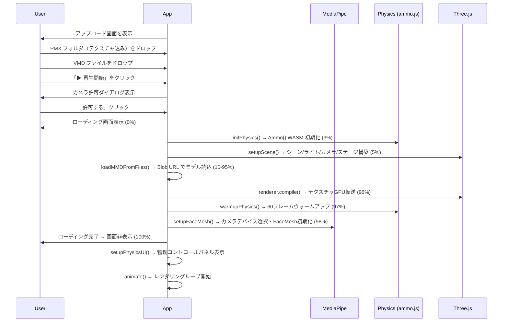
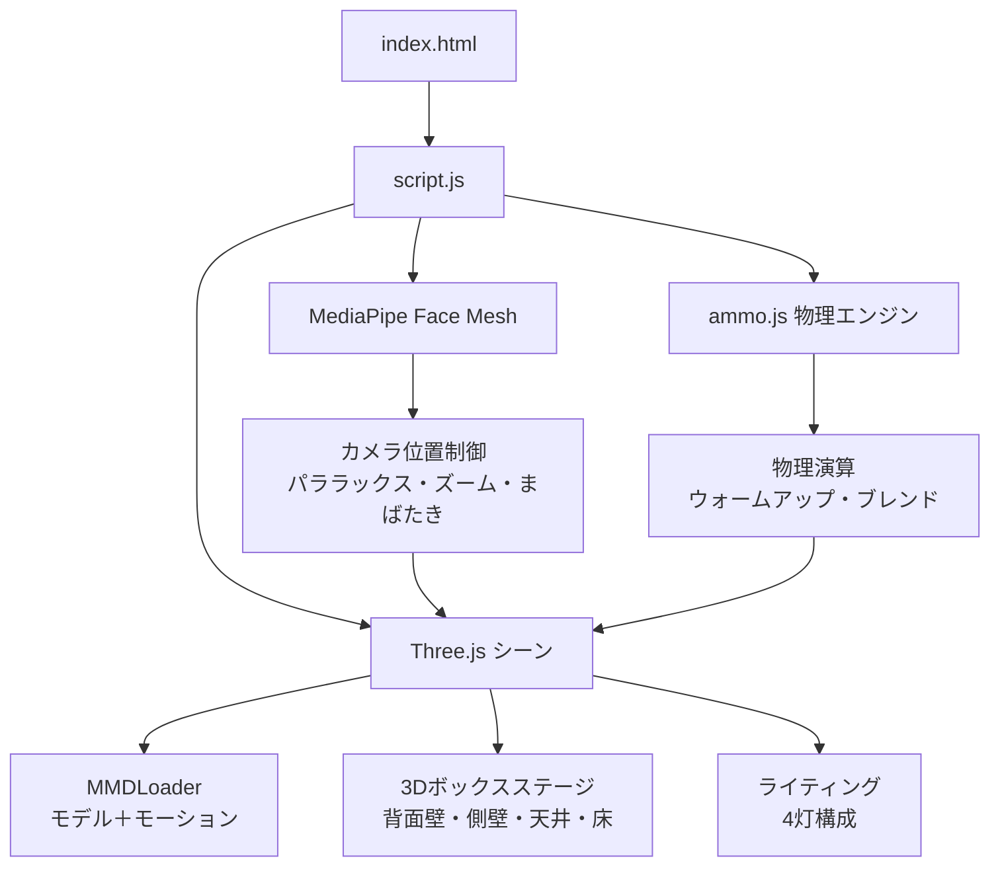
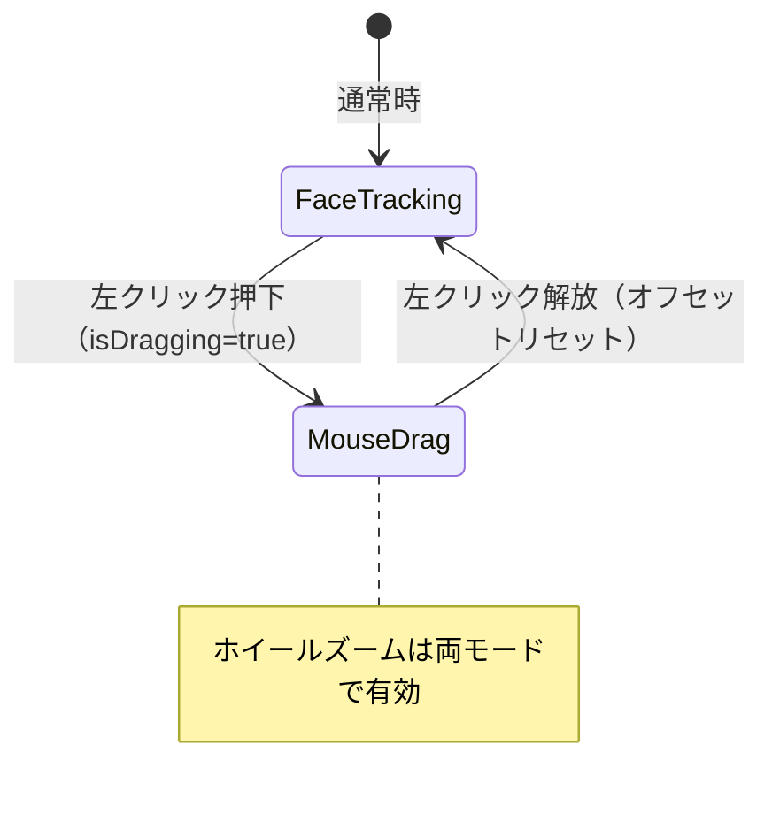
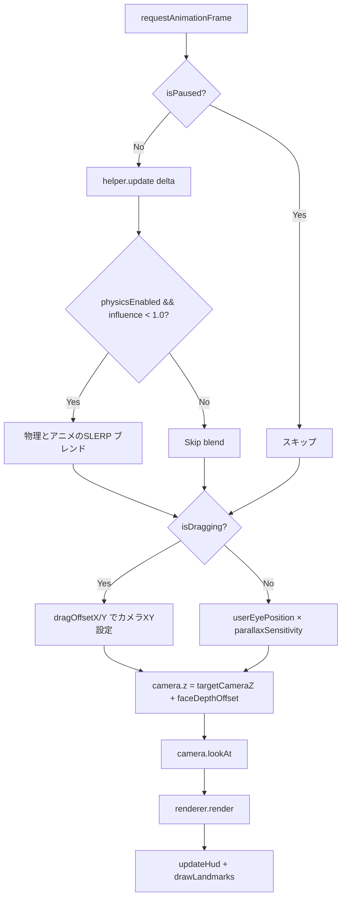

# 3D MMD Web Viewer — 仕様書 v2.0

> **最終更新**: 2026-03-16  
> **バージョン**: 2.0  
> **リポジトリ**: [yugeyashiki/3DViewMMD](https://github.com/yugeyashiki/3DViewMMD)  
> **ライブデモ**: https://yugeyashiki.github.io/3DViewMMD/  
> **対象者**: 開発者・再現者（作成者以外を含む）

---

## 1. アプリケーション概要

ブラウザ上でMMD（MikuMikuDance）モデルを3D表示し、Webカメラの顔トラッキングでリアルタイムにカメラアングルを操作するインタラクティブ3Dビューアー。

### 主な特徴

| 特徴 | 説明 |
|---|---|
| **PMX / VMD 対応** | ドラッグ＆ドロップでモデルとモーションをブラウザ上で直接再生 |
| **顔トラッキング連動カメラ** | MediaPipe Face Mesh による自然な視差（パララックス）効果 |
| **VTube Studio 連携** | 仮想カメラ入力を自動検出し高感度プロファイルへ切替 |
| **3Dボックスステージ** | 箱型の仮想空間で立体的な没入感を演出 |
| **物理演算（ammo.js）** | 有効/無効・影響度・リセットをUIで制御可能 |
| **ローディング画面** | 進捗バー付きのローディングUIで読込状態を可視化 |
| **デバッグHUD** | 顔トラッキングのリアルタイム数値・ランドマーク表示 |
| **フルブラウザ動作** | Node.js 不要、Chrome / Edge で Live Demo にアクセスするだけで使用可能 |

---

## 2. 技術スタック

| カテゴリ | 技術 | バージョン | 用途 |
|---|---|---|---|
| 3Dレンダリング | Three.js | ^0.160.0 | シーン構築・レンダリング・カメラ制御 |
| MMDモデル読込 | Three.js MMDLoader / MMDAnimationHelper | addon | PMX + VMD 読込・再生 |
| 顔トラッキング | MediaPipe Face Mesh | ^0.4.x | 顔ランドマーク検出 |
| カメラユーティリティ | @mediapipe/camera_utils | ^0.3.x | Webカメラストリーム管理 |
| 物理演算 | ammo.js (WASM) | CDN | MMD剛体・ジョイントシミュレーション |
| VRMサポート | @pixiv/three-vrm | ^3.0.0 | 将来的な拡張用（現在は未使用） |
| MMDパーサー | mmd-parser | ^1.0.4 | MMDファイルパース補助 |
| ビルドツール | Vite | ^5.0.0 | 開発サーバー・バンドル・HMR |
| 言語 | JavaScript (ES Modules) | — | アプリケーションロジック |
| CI/CD | GitHub Actions | — | GitHub Pages 自動デプロイ |

### CDN 読込（index.html）

| ライブラリ | 用途 |
|---|---|
| MediaPipe Face Mesh | グローバル `FaceMesh` クラス |
| ammo.wasm.js | グローバル `Ammo` 関数（物理演算） |

---

## 3. ディレクトリ構成

```
d:\AI3DViewMMD\
├── index.html              # メインHTML（UI・CSS・スタイル定義）
├── script.js               # アプリケーション全ロジック（約1,489行、単一ファイル構成）
├── package.json            # npm 依存関係定義
├── vite.config.js          # Vite設定（HMR、GitHub Pages base、/__mmd_assets エンドポイント）
├── Models/                 # （開発時）PMXモデルファイル・テクスチャ
├── Motions/                # （開発時）VMDモーションファイル
├── Videos/                 # （開発時）背景動画（MP4）
├── Background/             # 背景素材
├── README.md               # 日本語 / 英語ドキュメント
├── SPECIFICATION_v2.md     # 本ファイル（最新仕様書）
└── .github/workflows/      # GitHub Actions 設定
```

> [!NOTE]
> 本番（GitHub Pages）環境ではモデル・モーション等のアセットは含まれません。ユーザーがブラウザのアップロードUIから独自のファイルを使用してください。

---

## 4. 起動フロー・動作モード

アプリは2つのモードで動作します。

### モード 1: アップロードUIモード（本番 / GitHub Pages）

HTML に `#upload-screen` 要素が存在する場合に動作。ユーザーが自分のファイルをドラッグ＆ドロップして使用します。



### モード 2: 自動ロードモード（ローカル開発）

HTML に `#upload-screen` 要素がない場合は `/__mmd_assets` エンドポイントからモデル・モーションを自動取得して起動。Vite の `vite.config.js` でカスタムプラグインが `Models/`, `Motions/` のファイル一覧を JSON で返します。

---

## 5. アーキテクチャ

### 5.1 全体構成



### 5.2 主要ファイル

| ファイル | 役割 | 規模 |
|---|---|---|
| `index.html` | HTML構造、CSS、全UIコンポーネント（アップロード画面、ローディング、HUD、物理パネル等） | ~700行 |
| `script.js` | 全アプリロジック（初期化、3D、トラッキング、物理、アップロード、HMR） | ~1,489行 |
| `vite.config.js` | Vite設定、カスタムHMRプラグイン、`/__mmd_assets` エンドポイント | ~100行 |

### 5.3 主要関数一覧

| 関数名 | 責務 |
|---|---|
| `init(modelUrl, motionUrls)` | 自動ロードモード用の初期化（非同期） |
| `setupScene()` | シーン・ライト・カメラ・ステージの共通初期化 |
| `setupThreeJS()` | Three.js カメラ・レンダラー・マウス入力イベント設定 |
| `setupRoom()` | 床面・3Dボックスステージの構築 |
| `setupBoxStage(parentGroup)` | 背面壁・側壁・天井の計算と生成 |
| `updateBoxStageSize()` | ウィンドウリサイズ時のボックス再計算 |
| `loadMMDAsync(modelUrl, motionUrls)` | サーバーURL経由のMMD非同期読込（開発用） |
| `loadMMDFromFiles(pmxFile, vmdFiles, allFiles)` | Blob URL経由のMMD読込（アップロード用） |
| `buildFileMap(files)` | アップロードファイルのテクスチャURLマップ生成 |
| `requestCameraPermission()` | カメラアクセス同意UI管理 |
| `setupFaceMesh()` | MediaPipe初期化、カメラデバイス選択、ショートカット登録 |
| `startCamera(selectedDevice)` | カメラストリーム開始・プロファイル自動切替 |
| `onFaceResults(results)` | 顔検出結果のHUD更新・トラッキング呼び出し |
| `updateTracking(lm)` | パララックス・ズーム・まばたきの計算 |
| `animate()` | メインレンダリングループ（rAF） |
| `initPhysics()` | ammo.js WASM初期化 |
| `warmupPhysics(frames)` | 物理ウォームアップ（爆発防止） |
| `resetPhysics()` | 物理リセット |
| `setupPhysicsUI()` | 物理コントロールパネルのUI設定 |
| `startFromUpload()` | アップロードUIから3D再生を開始する全体フロー |
| `showLoadingScreen()` / `hideLoadingScreen()` | ローディング画面の表示・非表示 |
| `updateLoadingProgress(percent, message)` | プログレスバー更新 |
| `updateHud()` | HUDテキスト・バーの差分更新 |
| `drawLandmarks()` | ランドマークのCanvas描画 |
| `reloadMMD()` | HMR受信時のMMD再ロード |

---

## 6. 機能仕様

### 6.1 アップロードUI

ユーザーが自分のMMDファイルをブラウザ上で指定する画面。

| 項目 | 詳細 |
|---|---|
| **PMX ドロップゾーン** | フォルダごとドロップ（`<input webkitdirectory>`）でテクスチャ自動解決 |
| **VMD ドロップゾーン** | 複数VMDファイルを同時指定可能 |
| **再生ボタン** | PMX + VMD が揃って初めて `active` 状態になりクリック可能 |
| **テクスチャ解決** | `buildFileMap()` でファイル名・相対パス・バックスラッシュ変換の3パターンで検索 |
| **対応テクスチャ形式** | `.png`, `.jpg`, `.jpeg`, `.bmp`, `.tga`, `.spa`, `.sph` |

### 6.2 ローディング画面

| ステップ | 進捗 | メッセージ |
|---|---|---|
| 物理エンジン初期化 | 3% | 物理エンジンを初期化中... |
| シーンセットアップ | 5% | シーンをセットアップ中... |
| モデル読込開始 | 10% | モデルを読み込み中... |
| テクスチャ読込 | 10～95% | テクスチャを読み込み中... (N/M) |
| GPU転送 | 96% | テクスチャをGPUに転送中... |
| 物理ウォームアップ | 97% | 物理演算をウォームアップ中... |
| カメラ初期化 | 98% | カメラを初期化中... |
| 完了 | 100% | 完了！ |

### 6.3 3Dモデル表示・モーション再生

| 項目 | 仕様 |
|---|---|
| モデル形式 | PMX（MikuMikuDance） |
| モーション形式 | VMD（複数ファイル同時指定対応） |
| 物理演算 | ammo.js WASM（デフォルト: UIで制御） |
| アニメーション制御 | `MMDAnimationHelper`（sync: true, afterglow: 2.0, resetPhysicsOnLoop: true） |
| テクスチャ欠落時 | グレー（`0xcccccc`）にフォールバック |
| 透過マテリアル対応 | `transparent / tranceparent / highlight / ハイライト` を名前で自動検出し修正 |
| シャドウ | キャスト・レシーブ両方有効 |

### 6.4 物理演算（ammo.js）

| 項目 | 詳細 |
|---|---|
| ライブラリ | ammo.wasm.js（CDN経由） |
| 初期化 | `initPhysics()` → `Ammo()` WASM Promise で非同期初期化 |
| ウォームアップ | デフォルト60フレーム（`CONFIG.PHYSICS.WARMUP_FRAMES`）の事前シミュレーション |
| 影響度スライダー | 0〜100%でアニメーションと物理をクォータニオン SLERP でブレンド |
| リセット | helper.enabled.physics を一瞬 false→true にして剛体を初期位置に戻す |
| ammo.js 未ロード時 | UIパネルをグレーアウトし「N/A」表示 |

**CONFIG.PHYSICS:**
```javascript
PHYSICS: {
    WARMUP_FRAMES: 60,
    DEFAULT_INFLUENCE: 1.0  // 0.0〜1.0
}
```

### 6.5 顔トラッキング（MediaPipe Face Mesh）

MediaPipe Face Meshで顔ランドマークを検出し、3つの要素をリアルタイムに制御する。

#### トラッキング対象

| 機能 | ランドマーク | 処理 |
|---|---|---|
| **パララックス（視差）** | #1（鼻先） | (x-0.5), -(y-0.5) → カメラXY位置に変換 |
| **ズーム（奥行き）** | #133, #362（目の内隅） | 初回キャリブレーション → 距離変化 → カメラZ位置 |
| **まばたき** | #159, #145, #33, #133 | 目の開閉量 → MMDモーフターゲット（まばたき/Blink等） |

#### トラッキングパラメータ（CONFIG）

| パラメータ | デフォルト | 説明 |
|---|---|---|
| `EYE_SCALE_X` | 20.0 | X軸方向の移動感度 |
| `EYE_SCALE_Y` | 18.0 | Y軸方向の移動感度 |
| `EYE_OFFSET_Y` | 14.0 | Y軸のベースオフセット |
| `EYE_POS_Z` | 30.0 | 初期Z位置 |
| `LERP_SPEED` | 0.25 | 位置の線形補間速度（0-1） |
| `BLINK_THRESHOLD` | 0.08 | まばたき判定の閾値 |

#### まばたきモーフターゲット名（自動検索）
`まばたき`, `Blink`, `まばたき左`, `まばたき右`

#### ズーム計算アルゴリズム
```
# 初回検出時にキャリブレーション
baseFaceDistance = 目の内隅間距離

# 毎フレーム
depthChange = (currentDist - baseFaceDistance) × FACE_DEPTH_FACTOR
faceDepthOffset = LERP(faceDepthOffset, -depthChange, FACE_DEPTH_LERP)
```

### 6.6 カメラ操作（3入力の協調制御）

| 入力ソース | 制御対象 | 条件 |
|---|---|---|
| **顔トラッキング** | カメラXY位置 + Z（ズーム） | ドラッグ中は一時停止 |
| **マウスドラッグ（左クリック）** | カメラXY位置 | 顔トラッキングと排他 |
| **マウスホイール** | カメラZ（手動ズーム） | 常時有効 |

#### 排他方式（Exclusive Mode）



- ドラッグ中: カーソルが `grabbing` に変化
- 解放時: `dragOffsetX / dragOffsetY = 0` にリセット
- ドラッグ感度: `DRAG_SENSITIVITY = 0.3`

### 6.7 動的カメラプロファイル

カメラデバイス名で自動切替。

| パラメータ | NORMAL（物理カメラ） | VTS（仮想カメラ） |
|---|---|---|
| `ZOOM_MIN_Z` | 10 | 10 |
| `ZOOM_MAX_Z` | 150 | 300 |
| `FACE_DEPTH_FACTOR` | 1,200 | 4,500 |
| `FACE_DEPTH_LERP` | 0.1 | 0.08 |
| `PARALLAX_SENSITIVITY` | 7.5 | 18.0 |

**VTSプロファイル適用キーワード:** `vtubestudio`, `vtube studio`, `nizima`, `3tene`, `virtual camera`

### 6.8 カメラデバイス管理

| 機能 | 仕様 |
|---|---|
| デフォルト選択 | 物理カメラ優先（仮想カメラを除外して検索） |
| フォールバック順 | 物理カメラ → VTS/nizima仮想カメラ → 最初のデバイス |
| 手動切替 | 「📷 ｶﾒﾗ切替」ボタンでローテーション |
| ストリーム解像度 | 1280×720（ideal指定） |
| NotReadableError | 占有エラー専用メッセージを表示 |
| OverconstrainedError | カメラ許可確認と再読込を案内 |

**仮想カメラ除外キーワード:** `vtubestudio`, `vtube studio`, `obs`, `unity`, `webcam 7`, `splitcam`, `manycam`, `nizima`, `virtual camera`

### 6.9 デバッグHUD（Hキーでトグル）

顔トラッキングのリアルタイム数値をオーバーレイ表示する。

| 表示項目 | 内容 |
|---|---|
| 顔検出ステータス | `● DETECTED` / `● NOT DETECTED` |
| X軸値 | 鼻先X座標 正規化値（-0.5〜0.5） |
| Y軸値 | 鼻先Y座標 正規化値（-0.5〜0.5） |
| Zオフセット | 顔距離から計算した奥行きオフセット |
| バーUI | X/Y/Z それぞれをセンタードバーで視覚化 |
| ランドマークCanvas | 鼻先(#1)・目内角(#133, #362)・顎先(#152)等を全画面Canvasに描画 |

---

## 7. シーン構成

### 7.1 ライティング（4灯構成）

| # | 種類 | 色 | 強度 | 位置 | 役割 |
|---|---|---|---|---|---|
| 1 | `HemisphereLight` | 白/グレー | 1.0 | (0, 20, 0) | 天空・地面からの環境光 |
| 2 | `DirectionalLight` | 白 | 1.5 | (5, 20, 10) | メインライト（影あり） |
| 3 | `AmbientLight` | 白 | 0.8 | — | 全体のフィル光 |
| 4 | `PointLight` | 白 | 1.0 | (0, 15, 5) | モデル付近の補助光 |

### 7.2 カメラ

| 項目 | 値 |
|---|---|
| タイプ | `PerspectiveCamera` |
| FOV | 20° |
| Near / Far | 0.1 / 1000 |
| 初期位置 | (0, 12, 110) |
| 注視点 | (0, 15, 0) |

### 7.3 レンダラー

| 項目 | 設定 |
|---|---|
| タイプ | `WebGLRenderer` |
| アンチエイリアス | 有効 |
| alpha | 有効 |
| ピクセル比 | `window.devicePixelRatio` |
| シャドウマップ | 有効 |
| 色空間 | `SRGBColorSpace` |

### 7.4 3Dボックスステージ

ブラウザ画面を「3Dの箱の中」に見せる仮想空間構造。

| 要素 | 配置 | 向き |
|---|---|---|
| **バックスクリーン（背面壁）** | Z = BACK_Z（-50）| カメラに正対 |
| **左壁** | バックスクリーン左端 | Y軸 +90° |
| **右壁** | バックスクリーン右端 | Y軸 -90° |
| **天井** | バックスクリーン上端 | X軸 +90° |
| **床面** | Y = -0.1 | X軸 -90° |

**バックスクリーンのサイズ計算（FOVに基づく動的計算）:**
```
D (距離) = カメラZ位置 - バックスクリーンZ位置
height   = 2 × D × tan(FOV / 2)
width    = height × アスペクト比
```

**マテリアル（CONFIG.BOX_STAGE）:**

| プロパティ | 値 |
|---|---|
| タイプ | `MeshStandardMaterial` |
| 描画面 | `DoubleSide` |
| roughness | 0.8 |
| metalness | 0.1 |
| color | 0x1a1a2e |
| opacity | 0.95 |

> [!NOTE]
> ウィンドウリサイズ時に `updateBoxStageSize()` が全ジオメトリを再計算します。

---

## 8. UIコンポーネント

### 8.1 アップロード画面（`#upload-screen`）
- フルスクリーンの初期画面
- PMX ドロップゾーン（`#pmx-zone`）・VMD ドロップゾーン（`#vmd-zone`）
- 再生ボタン（`#start-btn`）: 両ファイル揃うと `active` クラス付与

### 8.2 ローディング画面（`#loading-screen`）
- プログレスバー（`#loading-bar`）+ パーセント表示（`#loading-percent`）
- ステータステキスト（`#loading-status`）
- フェードイン/アウトアニメーション

### 8.3 カメラ許可ダイアログ（`#consent-overlay`）
- 「許可する」（`#allow-camera`）/ 「拒否する」（`#deny-camera`）
- プライバシー表示（映像データはデバイス内のみで処理）
- 一度許可すると `cameraPermissionGranted = true` フラグでダブル表示を防止

### 8.4 カメラプレビューウィンドウ
- 左上（`#input_video`）、ミラー表示（`scaleX(-1)`）
- Hキーでトグル
- 「📷 ｶﾒﾗ切替」`#switch-camera` / 「✖ 消す」ボタン

### 8.5 物理コントロールパネル（`#physics-panel`）
- 3D再生開始後に `display: block` に切替
- `#physics-toggle`: ON/OFF ボタン
- `#physics-influence`: 影響度スライダー（0〜100%）
- `#physics-reset`: 物理リセットボタン
- ammo.js 未ロード時はパネル全体をグレーアウト（`opacity: 0.4`）

### 8.6 デバッグHUD（`#tracking-hud`）
- Hキーでトグル
- X/Y/Zの数値表示（`#hud-x, #hud-y, #hud-z`）
- センタードバー（`#bar-x, #bar-y, #bar-z`）
- ランドマークCanvas（`#landmark-canvas`）: 全画面オーバーレイ

### 8.7 エラーダイアログ（`#error-container`）
- ダークモード、赤枠
- 「閉じる」（操作継続）/ 「再読み込み」（ページリロード）

---

## 9. キーボードショートカット

| キー | 機能 |
|---|---|
| **H** | デバッグHUD・ランドマークCanvasの表示/非表示 |
| **Space** | MMDモーションの一時停止/再開 |

**一時停止中の挙動:**

| 要素 | 状態 |
|---|---|
| MMDモーション | ⏸ 停止 |
| 顔トラッキング | ▶ 動作継続 |
| マウスドラッグ | ▶ 操作可能 |
| マウスホイール | ▶ 操作可能 |

---

## 10. メインループ（animate）

毎フレーム以下の処理を実行:



---

## 11. CONFIG 設定パラメータ一覧

### 表示・カメラ

| キー | デフォルト | 説明 |
|---|---|---|
| `MONITOR_WIDTH` | 0.5 | 仮想モニタ幅（トラッキング計算用） |
| `CAMERA_FOV` | 20 | 視野角（度） |
| `CAMERA_NEAR` | 0.1 | ニアクリップ距離 |
| `CAMERA_FAR` | 1000 | ファークリップ距離 |
| `CAMERA_POSITION` | {x:0, y:12, z:110} | 初期カメラ位置 |
| `CAMERA_LOOKAT` | {x:0, y:15, z:0} | カメラ注視点 |

### 顔トラッキング

| キー | デフォルト | 説明 |
|---|---|---|
| `EYE_SCALE_X` | 20.0 | X軸移動感度 |
| `EYE_SCALE_Y` | 18.0 | Y軸移動感度 |
| `EYE_OFFSET_Y` | 14.0 | Y軸ベースオフセット |
| `EYE_POS_Z` | 30.0 | 初期Z位置 |
| `LERP_SPEED` | 0.25 | 補間速度 |
| `BLINK_THRESHOLD` | 0.08 | まばたき検出閾値 |

### シーン

| キー | デフォルト | 説明 |
|---|---|---|
| `BACKGROUND_COLOR` | 0x333333 | シーン背景色 |
| `LIGHT_INTENSITY` | 1.5 | DirectionalLight強度 |
| `AMBIENT_INTENSITY` | 0.8 | AmbientLight強度 |

### MMD

| キー | デフォルト | 説明 |
|---|---|---|
| `MMD.MODEL_PATH` | '' | モデルURL（動的に設定） |
| `MMD.MOTION_PATHS` | [] | モーションURL配列（動的に設定） |
| `MMD.USE_PHYSICS` | false | initPhysics() で true に切替 |

### 物理演算

| キー | デフォルト | 説明 |
|---|---|---|
| `PHYSICS.WARMUP_FRAMES` | 60 | ウォームアップフレーム数 |
| `PHYSICS.DEFAULT_INFLUENCE` | 1.0 | 物理影響度初期値 |

### ボックスステージ

| キー | デフォルト | 説明 |
|---|---|---|
| `BOX_STAGE.BACK_Z` | -50 | バックスクリーンZ位置 |
| `BOX_STAGE.WALL_COLOR` | 0x1a1a2e | 壁面色 |
| `BOX_STAGE.WALL_OPACITY` | 0.95 | 壁面透明度 |
| `BOX_STAGE.DEPTH` | 50 | 箱の奥行き |

### カメラプロファイル

| キー | NORMAL | VTS |
|---|---|---|
| `ZOOM_MIN_Z` | 10 | 10 |
| `ZOOM_MAX_Z` | 150 | 300 |
| `FACE_DEPTH_FACTOR` | 1200 | 4500 |
| `FACE_DEPTH_LERP` | 0.1 | 0.08 |
| `PARALLAX_SENSITIVITY` | 7.5 | 18.0 |

### 入力感度

| キー | デフォルト | 説明 |
|---|---|---|
| `WHEEL_SENSITIVITY` | 0.15 | マウスホイール感度 |
| `DRAG_SENSITIVITY` | 0.3 | マウスドラッグ感度（定数） |

---

## 12. デバッグモード

URLパラメータ `?debug` を付与すると有効化。

```
http://localhost:5173/?debug
```

| ログ内容 | 頻度 |
|---|---|
| FaceMesh 検出状態 | 2秒間隔 |
| 奥行き（Depth）計算値 | ランダムサンプリング（1%） |
| カメラプロファイル切替 | 切替時 |
| 一時停止/再開の状態変化 | 操作時 |
| ボックスステージ寸法 | 生成時・リサイズ時 |
| HUD 表示 / 非表示 | Hキー操作時 |

---

## 13. Vite カスタムプラグイン（開発時）

`vite.config.js` には以下のカスタム機能が実装されています:

### `/__mmd_assets` エンドポイント
- `Models/` と `Motions/` のファイル一覧を JSON で返す
- 開発時の自動ロードモードで使用

### `mmd:asset-changed` HMR イベント
- `Models/` または `Motions/` のファイルが変更された際に `mmd:asset-changed` カスタムイベントをフロントエンドへ送信
- `script.js` でイベントを受信し `reloadMMD()` を呼び出してモデルを自動再ロード

### GitHub Pages 設定
```javascript
base: process.env.NODE_ENV === 'production' ? '/3DViewMMD/' : '/'
```

---

## 14. 起動方法

### 本番（GitHub Pages）

[https://yugeyashiki.github.io/3DViewMMD/](https://yugeyashiki.github.io/3DViewMMD/) にアクセス。インストール不要。

### ローカル開発

```bash
# 依存関係のインストール
npm install

# 開発サーバーの起動（HMR有効）
npm run dev
```

ブラウザで `http://localhost:5173` にアクセス。

`Models/` や `Motions/` にファイルを配置すると自動検出されます。

### 本番ビルド

```bash
npm run build
```

---

## 15. 既知の制約・注意事項

| 項目 | 詳細 |
|---|---|
| **カメラ排他使用** | VTube Studio等が物理カメラを占有中はブラウザからアクセス不可。VTS仮想カメラを使用すること |
| **ブラウザ互換** | Chrome / Edge 推奨。MediaPipe Face Mesh は WebAssembly を使用 |
| **音声出力** | 背景動画はミュート再生（`muted` 属性）。音声が必要な場合は除去 |
| **単一ファイル構成** | 現在全ロジックが `script.js` に集約。大規模拡張時はモジュール分割を推奨 |
| **テクスチャ管理** | PMXモデルのテクスチャはモデルと同一フォルダに配置が必要 |
| **物理演算パフォーマンス** | 物理ON時はCPU負荷が上昇。ウォームアップ中はフリーズに見える場合あり |
| **ammo.js ロード** | CDN経由のため初回ロードに時間がかかる場合あり |

---

## 16. 将来的な拡張可能性

| カテゴリ | 拡張例 |
|---|---|
| **ステージ** | GLTFステージモデル設置、PMXステージ読込 |
| **ライティング** | SpotLight、動的ライト、ライティングプリセット |
| **エフェクト** | パーティクル、ポストプロセッシング（ブルーム/グロー） |
| **音楽連動** | Web Audio API によるBPM/周波数解析 → ライト・エフェクト制御 |
| **複数モデル** | 複数PMX/VRMモデルの同時表示 |
| **モーション生成** | 動画からモーションデータを生成（Media Pipe Pose等） |
| **UI拡張** | コントロールパネル、プリセット切替、複数シーン管理 |
| **VRM対応** | `@pixiv/three-vrm` を活用したVRMモデルサポート |
